# SkillSpark - Learn. Build. Launch.

SkillSpark is a modern, project-based learning platform designed specifically for university students to master in-demand tech skills. Whether you're looking to dive into Web Development, App Development, UI/UX Design, or AI & Data Science, SkillSpark provides the roadmap and community to help you succeed.

## 🚀 Key Features

- **Project-Based Learning**: We believe in learning by doing. Every course concludes with a professional, portfolio-ready project.
- **Vibrant Peer Community**: Join over 10,000 students. Collaborate, share feedback, and grow together in a supportive environment.
- **Industry-Recognized Certifications**: Boost your career prospects with certificates that validate your skills to employers.
- **Flexible Learning**: Designed for busy student schedules—access high-quality content anytime, anywhere, at your own pace.
- **Expert-Led Content**: Gain insights directly from industry professionals and experienced developers.

## 🛠️ Technologies Used

- **HTML5 & CSS3**: For semantic structure and modern, responsive styling.
- **Bootstrap 5**: Utilized for a mobile-first approach and rapid layout development.
- **Bootstrap Icons**: Consistent and sleek iconography across the entire platform.
- **JavaScript**: Powering interactive elements and smooth user experiences.

## 📸 Website Walkthrough

Below is a detailed walkthrough of the SkillSpark platform.

### 🏠 Home Page
The landing page introduces the platform with a modern hero section, key tech tracks, and testimonials.

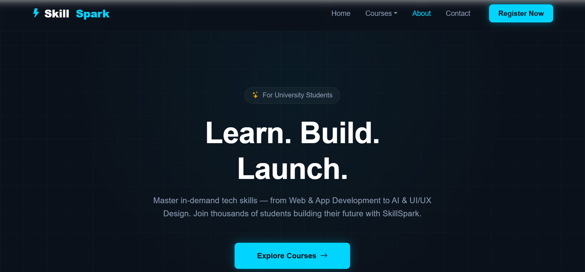
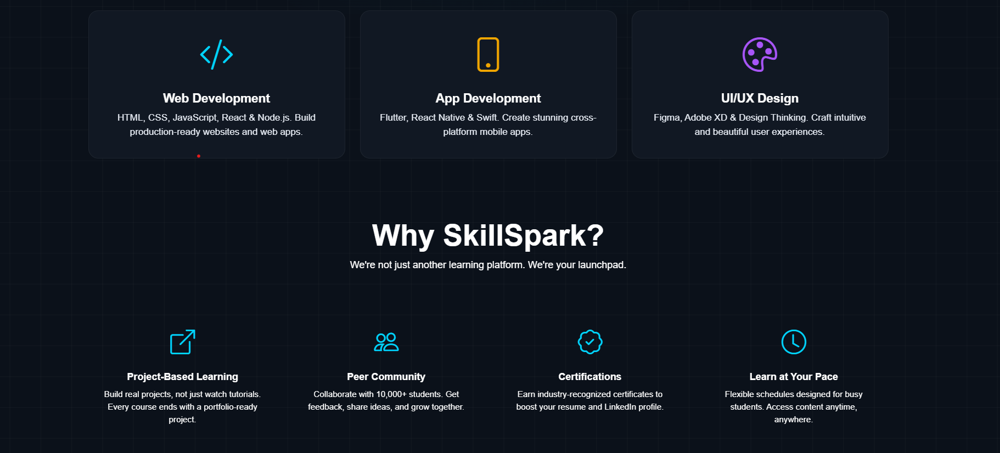
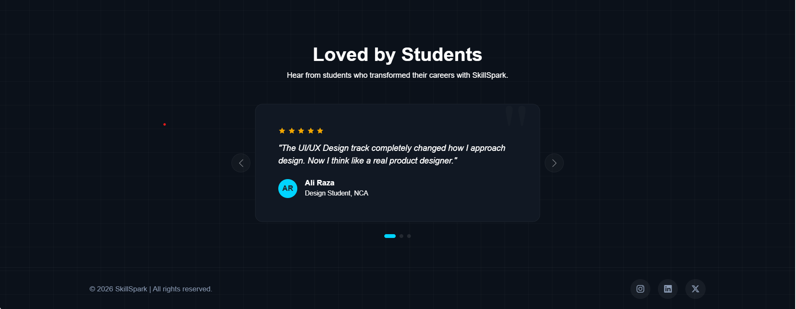

### 📚 Courses Page
Students can browse through various technical tracks and detailed course offerings.

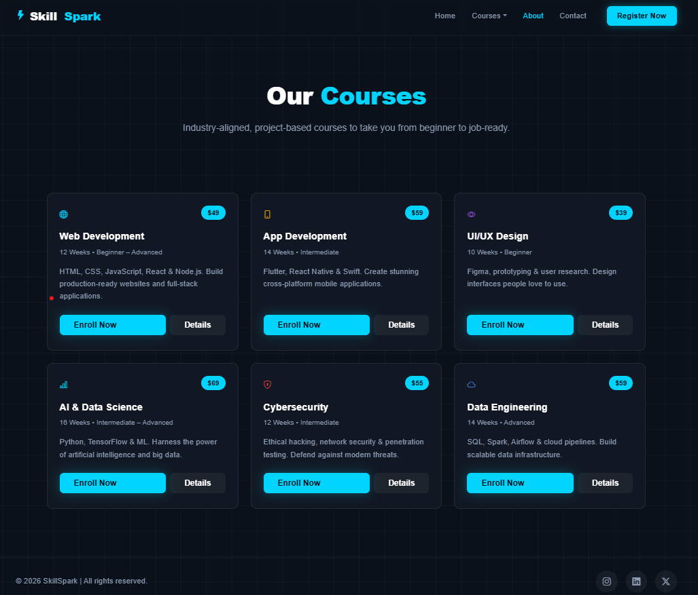
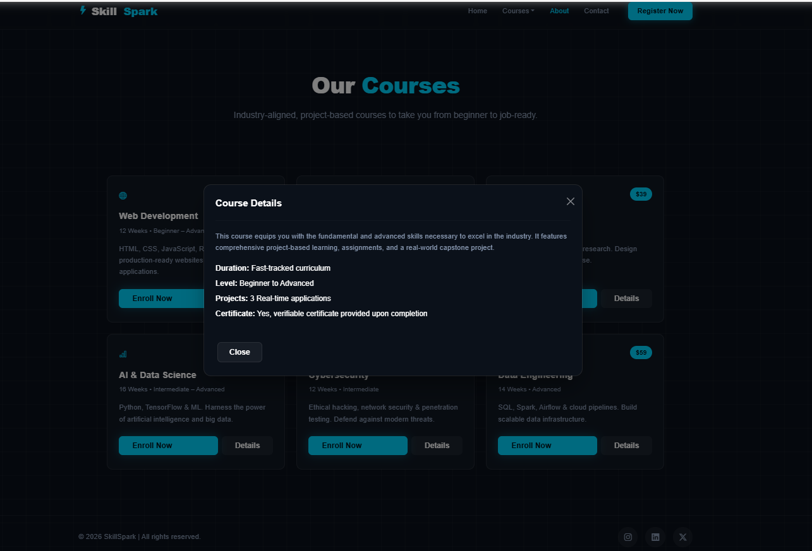

### 👥 About Page
Dedicated section about our mission, vision, and the community impact.

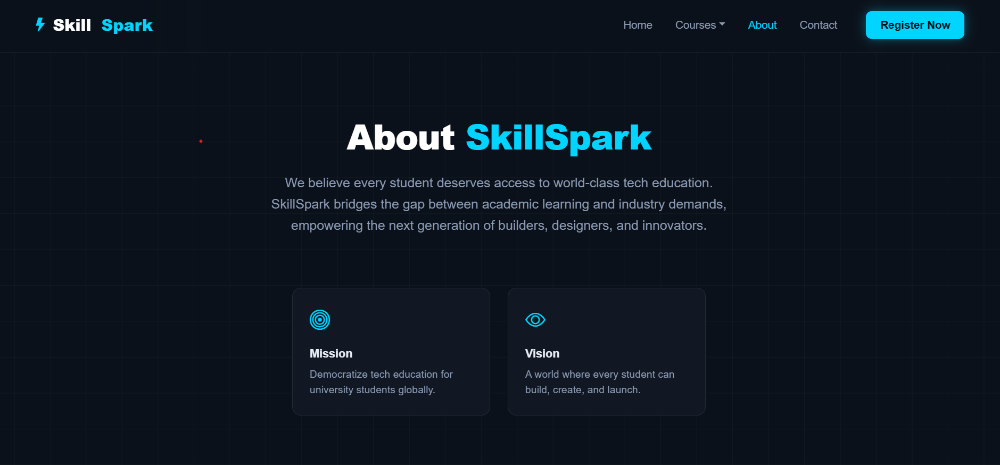
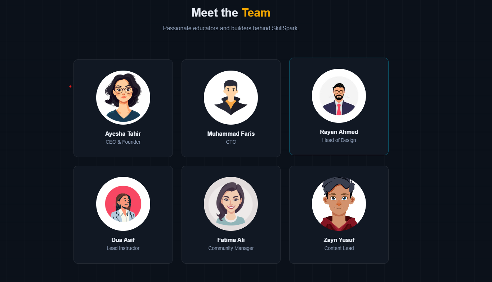
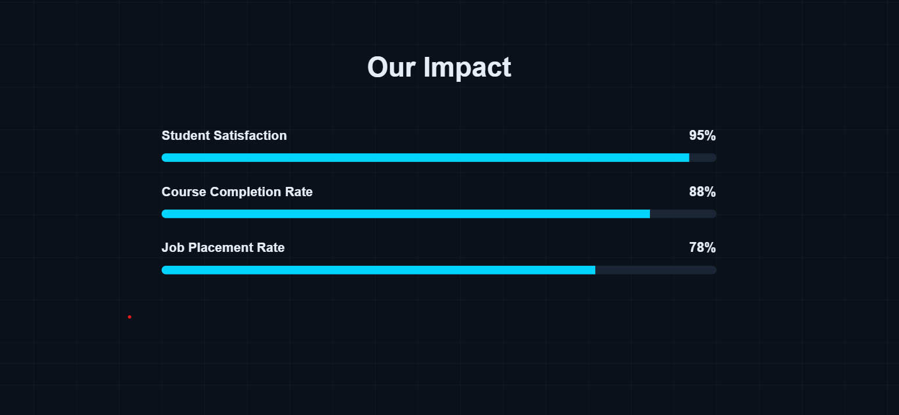
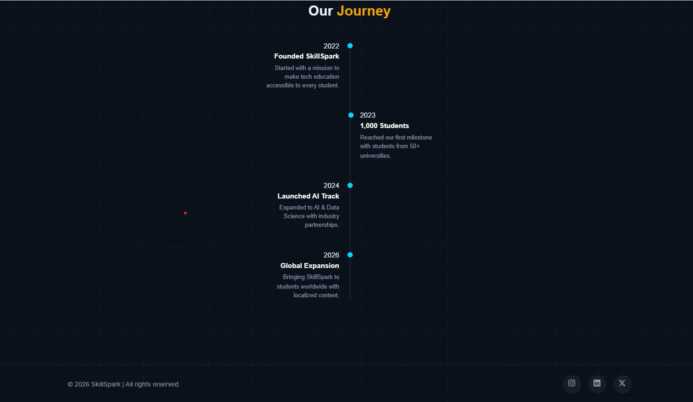

### ✉️ Contact Page
Easy access for students to reach out for support or inquiries.

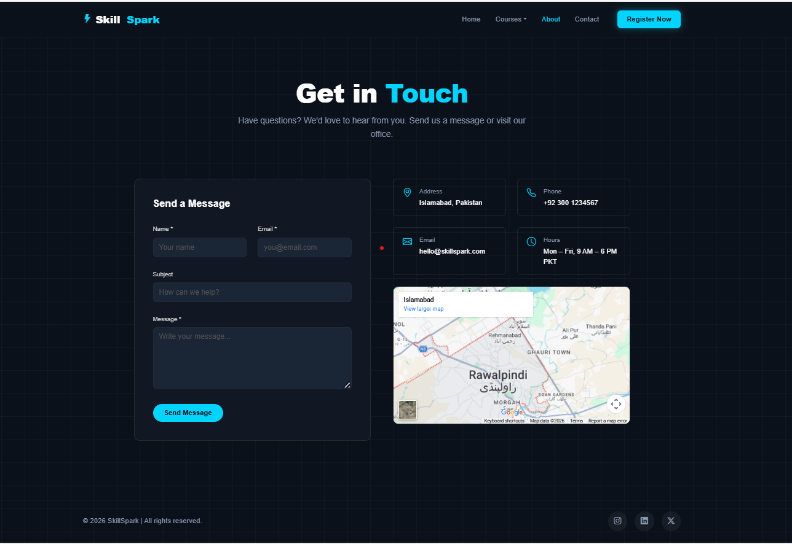
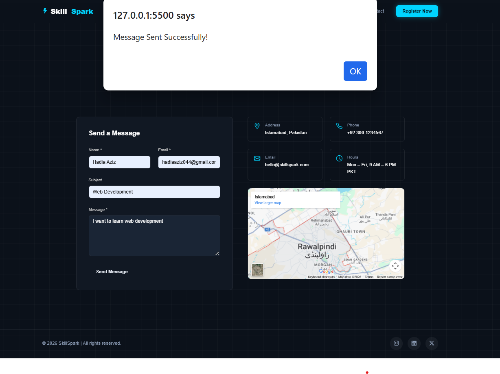

### 📝 Registration Page
The gateway for new students to join the SkillSpark community.

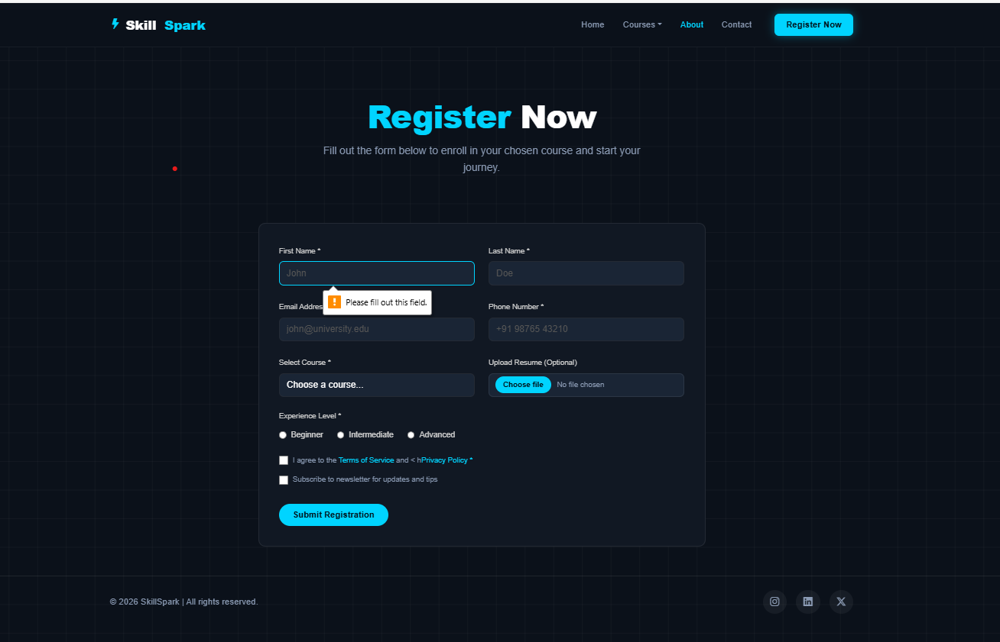

---

## Getting Started

To view the website locally, simply clone the repository and open `index.html` in your preferred web browser.

```bash
git clone https://github.com/Hadia-Aziz99/Skill-Spark-website.git
cd Skill-Spark-website
# Open index.html in your browser
```

© 2026 SkillSpark | All rights reserved.
